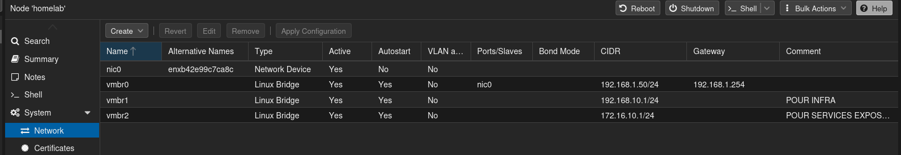
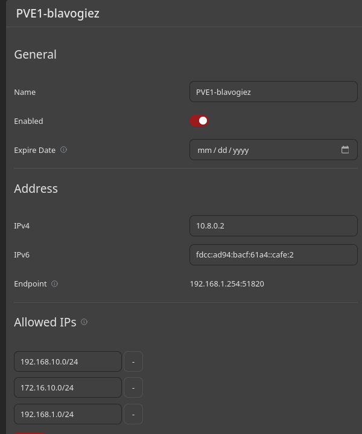
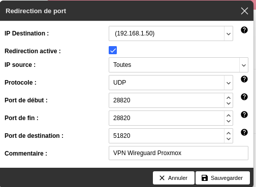
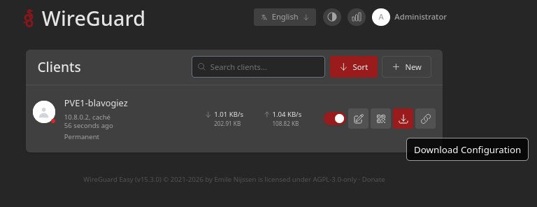
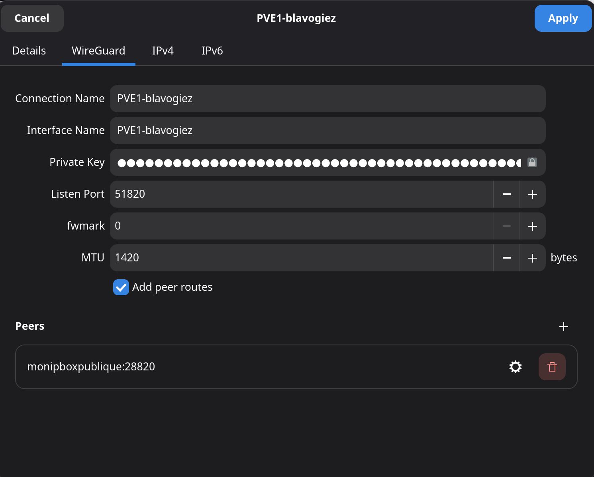

# Composants sur vmbr1 : Infrastructure d'administration du Proxmox

## Sous-réseaux

Ces sous-réseaux seront le coeur des services hébergés sur Proxmox. Ils sont isolés et injoignables par le reste du réseau privé.
Ils sont [décrits dans le dossier terraform](terraform/main.tf)



`vmbr1` désigne tous les services d'administration du PVE.
`vmbr2` désigne tous les services qui seront exposés (sites publics).

## VPN Wireguard

L'objectif est d'avoir accès au réseau privé de Proxmox depuis n'importe où, de façon sécurisée.

On installera le VPN Wireguard, en l'occurence `wg-easy`.

Voir les liens suivants pour installation :
- https://wg-easy.github.io/wg-easy/latest/examples/tutorials/basic-installation/
- https://github.com/wg-easy/wg-easy

### Variables utilisées

Ici, les variables suivantes représentent :
- `192.168.1.50` le root PVE central, accessible en réseau domestique
- `192.168.10.12` la machine Wireguard (cf Terraform), accessible en réseau isolé `vmbr1`

### Création d'un Client

### Accès privé

L'objectif est ici d'accéder aux réseaux isolés depuis un PC connecté sur le même réseau domestique que le root PVE central (dans le même logement).

Puisque les sous-réseaux `vmbr1` et `vmbr2` sont isolés, il faut un intermédiaire.
Ce sera le root PVE central qui fera l'intermédiaire.


C'est donc ici l'endpoint `192.168.1.50`, soit le root PVE central, qui sera pointé par le client et qui redirigera vers la machine Wireguard.

(pour une machine Wireguard sur l'ip `192.168.10.12`, telle que définie dans le Terraform)

```bash
root@homelab:~#   echo 'net.ipv4.ip_forward=1' >/etc/sysctl.d/99-ip-forward.conf
root@homelab:~#   sysctl -p /etc/sysctl.d/99-ip-forward.conf
root@homelab:~#   nft delete table ip wg_forward 2>/dev/null || true
root@homelab:~#   nft add table ip wg_forward
root@homelab:~#   nft 'add chain ip wg_forward prerouting { type nat hook prerouting priority dstnat; policy accept; }'
root@homelab:~#   nft 'add chain ip wg_forward forward { type filter hook forward priority filter; policy drop; }'
root@homelab:~#   nft add rule ip wg_forward prerouting iifname "vmbr0" udp dport 51820 dnat to 192.168.10.12:51820
root@homelab:~#   nft add rule ip wg_forward forward ct state established,related accept
root@homelab:~#   nft add rule ip wg_forward forward iifname "vmbr0" oifname "vmbr1" ip daddr 192.168.10.12 udp dport 51820 accept
root@homelab:~#   nft list ruleset >/etc/nftables.conf
root@homelab:~#   systemctl enable --now nftables
```

#### Configuration Wireguard

Puisqu'on est au tout début, on fait un tunnel SSH avec redirection de port pour aller sur l'UI wireguard, car le réseau est isolé.

On ajoute d'abord une route temporaire vers le réseau isolé via le root PVE central (quand on aura fini, on l'enlève) :

```bash
sudo ip route add 192.168.10.0/24 via 192.168.1.50
```

```bash
ssh -L 51821:127.0.0.1:51821 root@192.168.10.12
```

Ensuite, se rendre sur "http://localhost:51821", et créer un compte admin.

##### Configuration globale


##### Configuration spécifique




### Accès public

L'objectif est ici d'accéder aux réseaux isolés depuis un PC connecté sur n'importe quel réseau dans le mode.

Puisqu'on est en hébergement "civil", on peut exposer le port 51820 sur l'ip Publique de notre box réseau (Approche sans nom de domaine).

Par exemple pour une Freebox, on peut faire, [après connexion sur le panel admin](https://mafreebox.freebox.fr/#Fbx.os.app.settings.ports.PortRedir) :



L'idée est de pointer l'IP du root PVE central en cible.

Ensuite, on met l'adresse de notre box avec le port, par exemple `12.34.56.78:28820` comme endpoint du VPN.

(On peut également penser à des solutions comme un tunnel Cloudflare sur le PVE + nom de domaine si on veut aller plus loin sans box)

**Attention, il faut uniquement exposer le port 51820 qui est en UDP et aucun autre port, surtout par le port 51821 qui est l'UI Wireguard. Et de façon plus large, il faut exposer le moins de ports en public.**

### Chaîne finale

Le VPN contacterait alors `12.34.56.78:28820`, qui contacte le root PVE central, qui contacte ensuite la machine hébergeant WireGuard.

### Connexion par un client

Le client ajoutera son VPN, soit graphiquement, soit par CLI

#### Télécharger la configuration fichier

Du panneau Admin, on télécharge la configuration, puis on la transmet à la personne voulue.
La transmission doit être sécurisée car la configuration contient une clé privée.




#### Soit graphiquement

Ici réalisé sur Debian qui l'intègre nativement, configuration universelle avec Wireguard.


#### Soit en terminal

```bash
nmcli connection import type wireguard file ~/Downloads/PVE1-blavogiez.conf
nmcli connection up PVE1-blavogiez
```

#### Résultat



Nous avons donc accès à tous les sous-réseaux isolés définis dans `Allowed IPs` et depuis n'importe où, de façon sécurisée.
